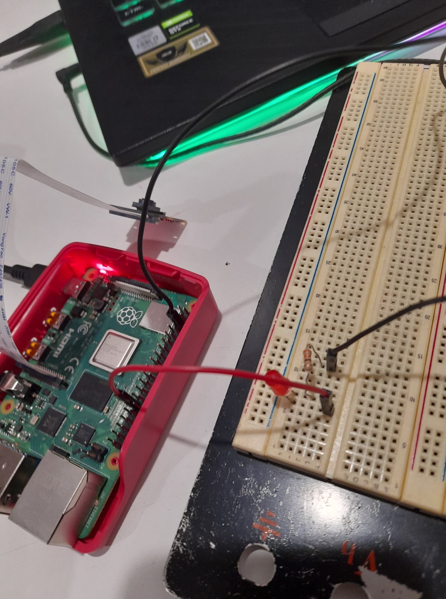

# bottle and remote LED detection by Raspberry Pi with Tenserflow Lite and OpenCV

# Installation
1. update rasp to latest version

```
sudo apt-get update
sudo apt-get dist-upgrade
```
Make sure the camera interface is enabled in the Raspberry Pi Configuration menu.

2.  Download this repository and create virtual environment

```
git clone https://github.com/jirawat-exe/Micro_Raspi_Project
```

Then rename and get in dir
```
mv Micro_Raspi_Project cam
cd cam
```

Install virtualenv by issuing:
```
sudo pip3 install virtualenv
```

Then, create the "tflite1-env" virtual environment by issuing:
```
python3 -m venv cam-env
```

activate the environment by issuing:
```
source cam-env/bin/activate
```

3. Install TensorFlow Lite dependencies and OpenCV

To make things easier, use a shell script that will automatically download and install all the packages and dependencies. Run it by issuing:
```
bash get_pi_requirements.sh
```

Then
```
sudo apt-get install libilmbase-dev
sudo apt-get install libopenexr-dev
sudo apt-get install libgstreamer1.0-dev
```

**NOTE: If you get an error while running the `bash get_pi_requirements.sh` command, it's likely because your internet connection timed out, or because the downloaded package data was corrupted. If you get an error, try re-running the command a few more times.**

**ANOTHER NOTE: The shell script automatically installs the latest version of TensorFlow. If you'd like to install a specific version, issue `pip3 install tensorflow==X.XX` (where X.XX is replaced with the version you want to install) after running the script. This will override the existing installation with the specified version.**

4. Set up TensorFlow Lite detection model

Download the sample model (which can be found on [the Object Detection page of the official TensorFlow website](https://www.tensorflow.org/lite/models/object_detection/overview)) by issuing:
```
wget https://storage.googleapis.com/download.tensorflow.org/models/tflite/coco_ssd_mobilenet_v1_1.0_quant_2018_06_29.zip
```

Unzip it to a folder called "Sample_TFLite_model" by issuing (this command automatically creates the folder):
```
unzip coco_ssd_mobilenet_v1_1.0_quant_2018_06_29.zip -d Sample_TFLite_model
```

5. Run the TensorFlow Lite model

It's time to see the TFLite object detection model in action! First, free up memory and processing power by closing any applications you aren't using. Also, make sure you have your webcam or Picamera plugged in.

Run the real-time webcam detection script by issuing the following command from inside the /home/pi/tflite1 directory. (Before running the command, make sure the tflite1-env environment is active by checking that (tflite1-env) appears in front of the command prompt.) **The TFLite_detection_webcam.py script will work with either a Picamera or a USB webcam.**
```
python3 TFLite_detection_webcam.py --modeldir=Sample_TFLite_model
```

If your model folder has a different name than "Sample_TFLite_model", use that name instead. For example, I would use `--modeldir=BirdSquirrelRaccoon_TFLite_model` to run my custom bird, squirrel, and raccoon detection model.

After a few moments of initializing, a window will appear showing the webcam feed. Detected objects will have bounding boxes and labels displayed on them in real time.

<p align="center">
   
</p>
